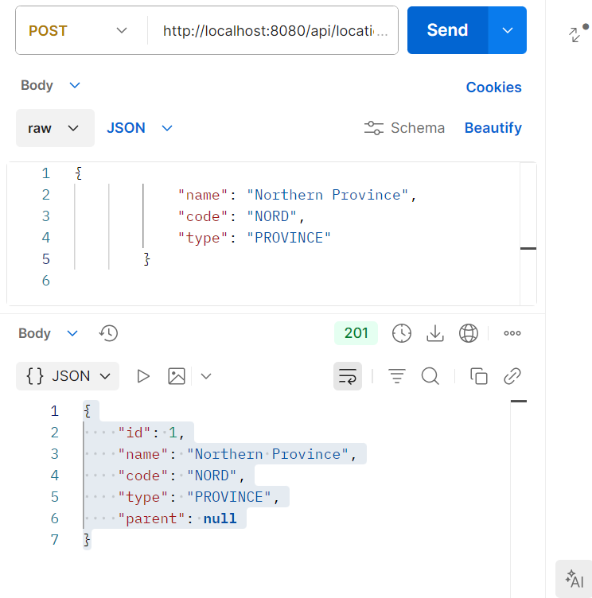
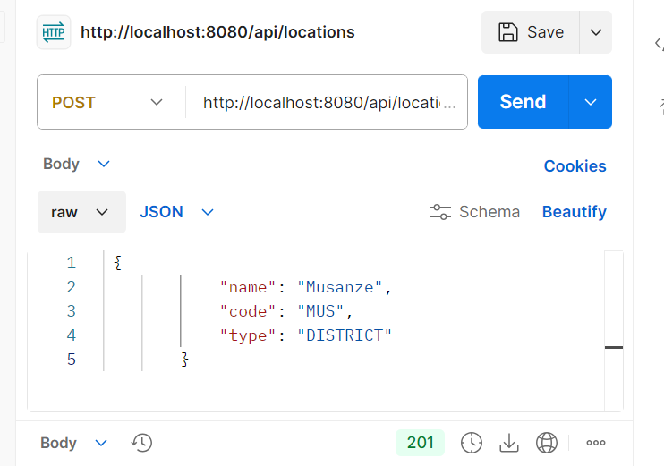
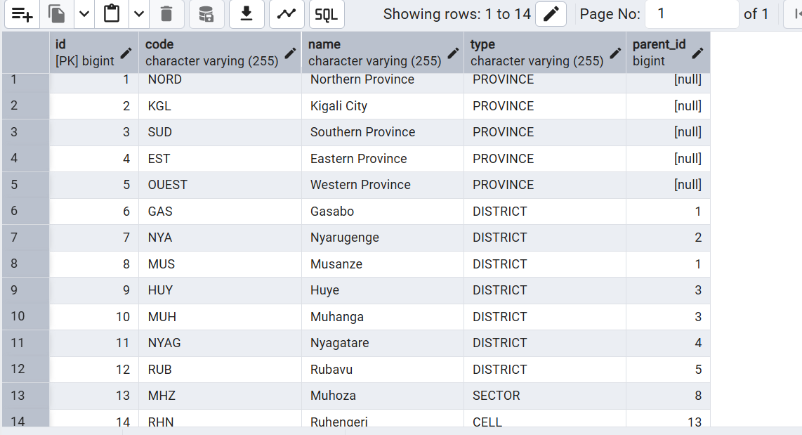
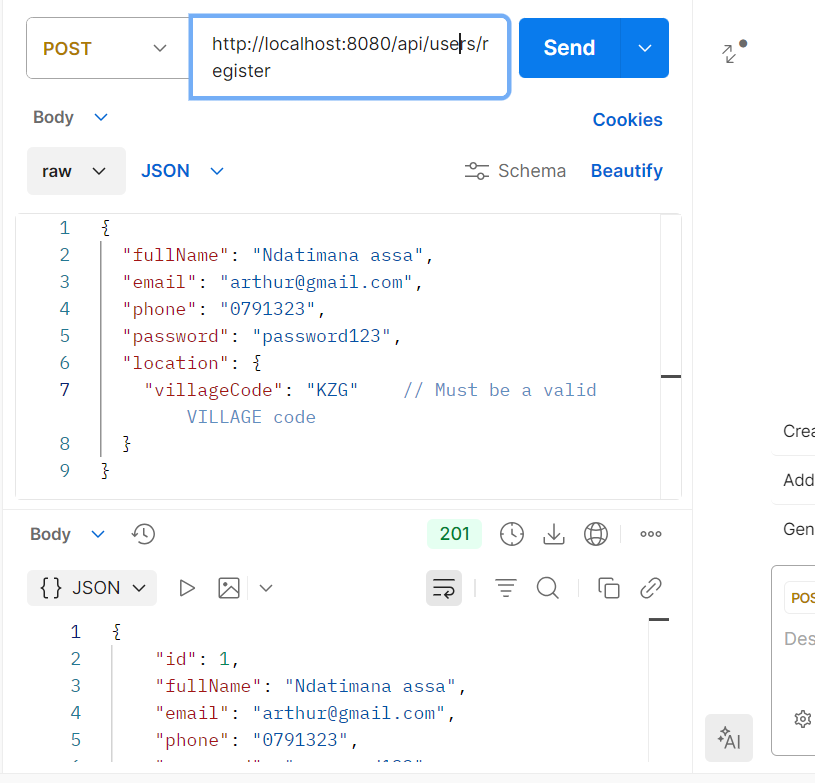
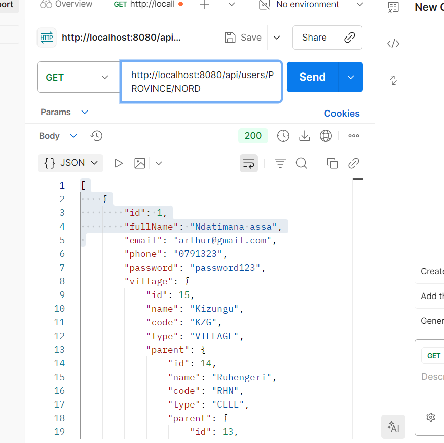

# QuickBuild E-Commerce Backend

QuickBuild is a robust Spring Boot REST API for a hardware and construction materials e-commerce platform built specifically for the Rwandan market.

## 📌 Project Overview
The core distinction behind QuickBuild is its deeply integrated **Rwandan location hierarchy system**. Unlike traditional e-commerce backends that accept plain text addresses, QuickBuild structures deliveries and users strictly through a self-referencing administrative hierarchy extending from Province down to Village. 

This ensures data integrity and powerful location-based querying for users and orders.

### Features
*   **Hierarchical Locations Engine:** Self-referencing locations managed by an `ELocationType` enum (Province → District → Sector → Cell → Village).
*   **User Management:** Register and track users securely via roles (`ADMIN`, `CUSTOMER`). Every user's physical address is strongly typed to an existing Village entity in the database.
*   **Catalog Management:** Organizes hardware tools and materials seamlessly via standard `Category` and `Product` models (supporting pagination, sorting, and multiple images per product).
*   **Dual Checkout System:** Capable of processing checkouts and reserving stock for both registered users and ad-hoc guests seamlessly.
*   **Rwanda Payments:** Supports region-specific enums natively (e.g., `MTN_MOMO`, `CASH_ON_DELIVERY`).

---

## 🏗️ Architecture & Tech Stack

**Core Framework:** Java 17, Spring Boot 3.x
**Database:** PostgreSQL (`spring-boot-starter-data-jpa`, Hibernate)
**Utilities:** Lombok (Boilerplate reduction), MapStruct (DTO Mapping), Validation

### Database Schema Map
The project utilizes a clean relational model containing 9 major tables:

1.  **Users System:** `users`, `roles`, `user_roles`
2.  **Catalog System:** `categories`, `products`, `product_images`
3.  **Order System:** `orders`, `order_items`
4.  **Geolocation:** `locations` (Self-referencing recursive hierarchy)

A customer can log in to place an `Order` containing multiple `OrderItem`s linked directly to hardware `Product`s. Every User and Order resolves down to a `Village` in the `locations` table.

---

## 📍 Understanding the Location Hierarchy

To enforce administrative consistency, a `Location` must be created in a strict parent-to-child sequence. 
The system actively validates this sequence in the Service Layer (e.g., A `SECTOR` can only have a `DISTRICT` as its parent).

1.  `PROVINCE` (No Parent)
2.  `DISTRICT` (Parent = Province)
3.  `SECTOR` (Parent = District)
4.  `CELL` (Parent = Sector)
5.  `VILLAGE` (Parent = Cell)

All users and orders must register a valid `villageCode` to successfully process.

---

## 🚦 Getting Started & Testing

### 1. Database Configuration
Ensure a PostgreSQL server is running locally on port `5432`.
Create a database named `quickbuild` or update the credentials inside `src/main/resources/application.properties`:

```properties
spring.datasource.url=jdbc:postgresql://localhost:5432/quickbuild
spring.datasource.username=postgres
spring.datasource.password=your_password
```
### 2. Run the Application
Start the project via Maven or your IDE:
```bash
mvn spring-boot:run
```
The application will start on `http://localhost:8080/`.

### 3. API Testing using Postman
This project includes pre-built Postman payload files (`locations_payload.json` and `postman_payloads.json`) located at the root directory to test data creation smoothly.

**Step 1. Build the Geography (Mandatory Sequence)**
You must create locations in descending order since the database checks for valid foreign keys.

*Create a Province:*
`POST http://localhost:8080/api/locations` 
```json
{
  "name": "Kigali City", "code": "KGL", "type": "PROVINCE"
}
```

*Create a District (Provide the Province's generated ID):*
`POST http://localhost:8080/api/locations?parentId=1` 
```json
{
  "name": "Gasabo", "code": "GAS", "type": "DISTRICT"
}
```

*(Continue this sequence down to Sector, Cell, and Village as outlined in the `locations_payload.json` file).*

**Step 2. Register a User**
Once a Village exists, register a user using the Village's code:
`POST http://localhost:8080/api/users/register`
```json
{
  "fullName": "Arthur Doe",
  "email": "arthur@example.com",
  "phone": "0780000000",
  "password": "password123",
  "location": {
    "villageCode": "KZG"    // Must be a valid VILLAGE code
  }
}
```

**Step 3. Catalog & Orders**
Use the sample requests in `postman_payloads.json` to create `Categories`, `Products`, and process a `Guest Checkout`!

---

## 📸 Required Assignment Screenshots

*(Please save your screenshots in the `screenshots/` folder at the root of this project and verify the filenames match the placeholders below.)*

The following screenshots are required to demonstrate the functional implementation of the Rwandan location hierarchy and relationships in the QuickBuild project:

### 1. Creating the Northern Province (Root)
**Description:** Creating the root level of the hierarchy. A Province has no parent.
**Endpoint:**
```http
POST http://localhost:8080/api/locations
```
**JSON Payload:**
```json
{
  "name": "Northern Province",
  "code": "NOR",
  "type": "PROVINCE"
}
```


### 2. Creating Musanze District (Child)
**Description:** Creating a district linked to the province using the `parentId` parameter. This demonstrates the correct routing and self-referencing relationship in the `locations` table.
**Endpoint:** *(Replace PROVINCE_ID with the actual ID returned from step 1)*
```http
POST http://localhost:8080/api/locations?parentId=PROVINCE_ID
```
**JSON Payload:**
```json
{
  "name": "Musanze",
  "code": "MUS",
  "type": "DISTRICT"
}
```


### 3. Database `locations` Table Hierarchy
**Description:** A screenshot of pgAdmin (or your database viewer) showing the `locations` table data. The hierarchy is stored using the `parent_id` column, proving the self-referencing entity implementation. It should display rows similar to:

*   **Northern Province** → `PROVINCE` → `parent_id`: *null*
*   **Musanze** → `DISTRICT` → `parent_id`: *(ID of Northern Province)*
*   **Muhoza** → `SECTOR` → `parent_id`: *(ID of Musanze)*
*   **Cyabararika** → `CELL` → `parent_id`: *(ID of Muhoza)*
*   **Kabazungu** → `VILLAGE` → `parent_id`: *(ID of Cyabararika)*



### 4. Registering a User (Village Mapping)
**Description:** Creating a user linked strictly to a Village. The full location hierarchy (Cell, Sector, District, Province) is determined automatically through the database parent relationships, removing the need to specify them here.
**Endpoint:**
```http
POST http://localhost:8080/api/users/register
```
**JSON Payload:**
```json
{
  "fullName": "Arthur Doe",
  "email": "arthur@example.com",
  "phone": "0780000000",
  "password": "password123",
  "location": {
    "villageCode": "KAB"
  }
}
```


### 5. Retrieving Users by Province
**Description:** Demonstrating complex queries by retrieving all users registered within a specific province. The system successfully traces the hierarchy upward from `Village → Cell → Sector → District → Province`.
**Endpoint:**
```http
GET http://localhost:8080/api/users/province/NOR
```


> **Conclusion:** These screenshots provide concrete evidence of the correct implementation of the self-referencing location hierarchy (one-to-many relationship) and the functional REST API endpoints handling hierarchical logic within the QuickBuild backend.
